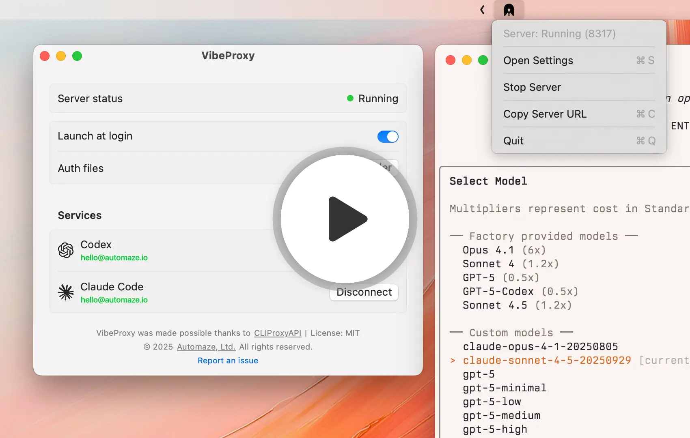

# VibeProxy

<p align="center">
  
</p>

<p align="center">
<a href="https://github.com/secondsky/vibeproxy"></a>
<a href="https://github.com/secondsky/vibeproxy/blob/main/LICENSE"></a>

</p>
</p>

> [!IMPORTANT]
> **This is a Fork**: This repository ([secondsky/vibeproxy](https://github.com/secondsky/vibeproxy)) is a fork of the original [automazeio/vibeproxy](https://github.com/automazeio/vibeproxy) with the following enhancements:
>
> **Added Features:**
> - **Multiple Accounts Per Provider**: Add unlimited accounts for each provider (e.g., multiple Claude Pro subscriptions, multiple Gemini accounts) and switch between them instantly
> - **Menu Bar Quick Switcher**: Flat "Accounts" section in the menu bar for instant 1-click account switching - no nested submenus, just click and go
> - **Enhanced Multi-Account UX**: Only shows providers that have configured accounts, with clean SF Symbols icons, checkmarks for active accounts, and real-time updates
> - **Unsigned Build Script**: `build-unsigned.sh` for personal use without Apple Developer Program subscription
> - **macOS 26.0.1 Compatibility**: Fixed settings window crashes and notification type issues
> - **Real-Time Auth Monitoring**: Automatic UI updates when auth files change
>
> All core functionality from the original is preserved. These changes focus on improved UX and easier personal deployment.

**Stop paying twice for AI.** VibeProxy is a beautiful native macOS menu bar app that lets you use your existing Claude Code, ChatGPT, **Gemini**, and **Qwen** subscriptions with powerful AI coding tools like **[Factory Droids](https://app.factory.ai/r/FM8BJHFQ)** – no separate API keys required.

Built on [CLIProxyAPI](https://github.com/secondsky/CLIProxyAPI), it handles OAuth authentication, token management, and API routing automatically. One click to authenticate, zero friction to code.

> [!IMPORTANT]
> **NEW: Gemini and Qwen Support! 🎉** VibeProxy now supports Google's Gemini AI and Qwen AI with full OAuth authentication. Connect your accounts and use Gemini and Qwen with your favorite AI coding tools!

> [!IMPORTANT]
> **NEW: Extended Thinking Support! 🧠** VibeProxy now supports Claude's extended thinking feature with dynamic budgets (4K, 10K, 32K tokens). Use model names like `claude-sonnet-4-5-20250929-thinking-10000` to enable extended thinking. See the [Factory Setup Guide](FACTORY_SETUP.md#step-3-configure-factory-cli) for details.

<p align="center">
<br>
  <a href="https://www.loom.com/share/5cf54acfc55049afba725ab443dd3777"></a>
</p>

> [!TIP]
> Check out our [Factory Setup Guide](FACTORY_SETUP.md) for step-by-step instructions on how to use VibeProxy with Factory Droids.


## Features

- 🎯 **Native macOS Experience** - Clean, native SwiftUI interface that feels right at home on macOS
- 🚀 **One-Click Server Management** - Start/stop the proxy server from your menu bar
- 🔐 **OAuth Integration** - Authenticate with Codex, Claude Code, Gemini, and Qwen directly from the app
- 👥 **Multi-Account Support** - Manage multiple accounts per provider with intelligent switching
  - Add unlimited accounts for Claude Code, Codex, Gemini, and Qwen
  - **Auto-Switching**: Automatically switches accounts when hitting rate limits using round-robin load balancing
  - **Manual Control**: Choose your primary account in Settings via radio button selection
  - **Visual Management**: See all accounts with nicknames, emails, and connection status
- 📊 **Real-Time Status** - Live connection status and automatic credential detection
- 🔄 **Auto-Updates** - Monitors auth files and updates UI in real-time
- ⚡ **Menu Bar Quick Switcher** - Flat "Accounts" section for 1‑click account switching, only shows providers that have accounts
- 🎨 **Beautiful Icons** - Consistent template‑tinted icons (SF Symbols + service icons) that look great in light/dark mode
- 💾 **Self-Contained** - Everything bundled inside the .app (server binary, config, static files)


## Installation

**⚠️ Requirements:** macOS running on **Apple Silicon only** (M1/M2/M3/M4 Macs). Intel Macs are not supported.

### Download Pre-built Release (Recommended)

1. Go to the [**Releases**](https://github.com/automazeio/vibeproxy/releases) page
2. Download the latest `VibeProxy.zip`
3. Extract and drag `VibeProxy.app` to `/Applications`
4. Launch VibeProxy

**Code Signed & Notarized** ✅ - No Gatekeeper warnings, installs seamlessly on macOS.

### Build from Source

Want to build it yourself? See [**INSTALLATION.md**](INSTALLATION.md) for detailed build instructions.

**For personal use without Apple Developer account**: Run `./build-unsigned.sh` to create an unsigned app bundle that outputs to `/Users/eddie/Downloads/` - perfect for personal distribution and testing without code signing.

## Usage

### First Launch

1. Launch VibeProxy - you'll see a menu bar icon
2. Click the icon and select "Open Settings"
3. The server will start automatically
4. Click "Connect" for Claude Code, Codex, Gemini, or Qwen to authenticate

### Authentication

When you click "Connect":
1. Your browser opens with the OAuth page
2. Complete the authentication in the browser
3. VibeProxy automatically detects your credentials
4. Status updates to show you're connected

### Server Management

- **Toggle Server**: Click the status (Running/Stopped) to start/stop
- **Menu Bar Icon**: Shows active/inactive state
- **Launch at Login**: Toggle to start VibeProxy automatically

### Quick Account Switching (Menu Bar)

- Open the VibeProxy menu and find the **Accounts** section.
- Providers appear only when you have at least one account configured for them.
- Click an account name to switch instantly (checkmark indicates the active account).
- The menu rebuilds on open and updates in real‑time when credentials change.

## Requirements

- macOS 13.0 (Ventura) or later

## Development

### Project Structure

```
VibeProxy/
├── Sources/
│   ├── main.swift              # App entry point
│   ├── AppDelegate.swift       # Menu bar & window management
│   ├── ServerManager.swift     # Server process control & auth
│   ├── SettingsView.swift      # Main UI
│   ├── AuthStatus.swift        # Auth file monitoring
│   └── Resources/
│       ├── AppIcon.iconset     # App icon
│       ├── AppIcon.icns        # App icon
│       ├── cli-proxy-api       # CLIProxyAPI binary
│       ├── config.yaml         # CLIProxyAPI config
│       ├── icon-active.png     # Menu bar icon (active)
│       ├── icon-inactive.png   # Menu bar icon (inactive)
│       ├── icon-claude.png     # Claude Code service icon
│       ├── icon-codex.png      # Codex service icon
│       ├── icon-gemini.png     # Gemini service icon
│       └── icon-qwen.png       # Qwen service icon
├── Package.swift               # Swift Package Manager config
├── Info.plist                  # macOS app metadata
├── build.sh                    # Resource bundling script
├── create-app-bundle.sh        # App bundle creation script
└── Makefile                    # Build automation
```

### Key Components

- **AppDelegate**: Manages the menu bar item and settings window lifecycle
- **ServerManager**: Controls the cli-proxy-api server process and OAuth authentication
- **SettingsView**: SwiftUI interface with native macOS design
- **AuthStatus**: Monitors `~/.cli-proxy-api/` for authentication files
- **File Monitoring**: Real-time updates when auth files are added/removed

### Updating the bundled cli-proxy-api

- Run `make update-cli-proxy` to fetch and rebuild the binary from `secondsky/CLIProxyAPI` (defaults to `main`).
- Override with `CLIPROXY_REF=<tag|branch|commit>` to pin a specific revision.
- Output is written to `src/Sources/Resources/cli-proxy-api` and is bundled by `make app` / `build-unsigned.sh`.

## Credits

VibeProxy is built on top of [CLIProxyAPI](https://github.com/secondsky/CLIProxyAPI), an excellent unified proxy server for AI services.

Special thanks to the CLIProxyAPI project for providing the core functionality that makes VibeProxy possible.

## License

MIT License - see LICENSE file for details

## Support

- **Report Issues**: [GitHub Issues](https://github.com/automazeio/vibeproxy/issues)
- **Website**: [automaze.io](https://automaze.io)

---

© 2025 [Automaze, Ltd.](https://automaze.io) All rights reserved.
